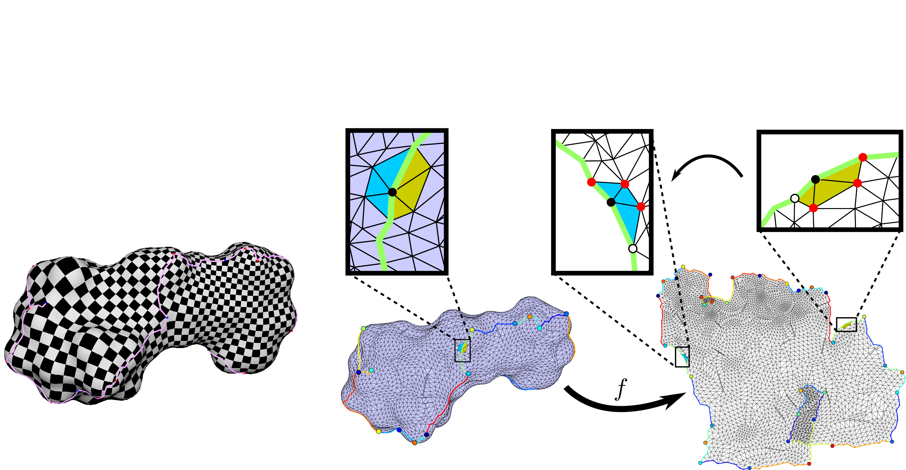

Last updated: 24/12/2018

Harmonic Global Parametrizations

--------------------------------------------------------------------------------------------------------------------------------------------------------

This code indludes the implementation of two papers:

1) HGP: SIGGRAPH 2017 paper "Harmonic Global Parametrization with Rational Holonomy" authored by Alon Bright, Edward Chien and Ofir Weber. 

2) FastHGP: EUROGRAPHICS 2019 paper "A Subspace Method for Fast Locally Injective Harmonic Mapping" authored by Eden Fedida Hefetz, Edward Chien and Ofir Weber. 

The use of this application is limited to academic use only!

The code is provided as-is and without any guarantees.

For questions or comments about the code please contact:
Alon Bright (alonbright@gmail.com) for the SIGGRAPH 2017 paper implementation
or Eden Fedida Hefetz (eden.fadid@gmail.com) for the EUROGRAPHICS 2019 paper implementation.

----------------------------------------------------------------------------
A Visual Studio 2017 (MSVC 14.1) project is provided for easy compilation on Windows machines.
The code should be platform independent though we never tested it on other than Windows OS.

The following prerequisites are necessary for building and running the code:

1) Matlab R2018b

2) CVX 2.1, Build 1112

3) Mosek 8

4) Boost 1.68 - Boost doesn't have an official 64bit binary deployment on Windows. We downloaded an unofficial deployment from here (http://boost.teeks99.com/) in order to avoid the need to build Boost.

5) CGAL 4.10.2 - CGAL has to be compiled with 64 bits dynamic (also called shared) - in order to do that we used cmake.

6) GMM C++ template library version 5.3 (http://getfem.org/download.html).

7) PARDISO 6.0

8) Eigen

9) tsurf function of gptoolbox is used for mesh visualization in MATLAB. (https://github.com/alecjacobson/gptoolbox/tree/master/mesh)

Other versions of the above listed tools might be compatible but weren't tested!

----------------------------------------------------------------------------

How to use:

1) Install and build the above mentioned prerequisites.

2) Add the following environment variables to your system (see some possible paths):

GMM_INCLUDE_DIR		(%your GMM folder path%)\gmm-5.3\include

MATLAB_64_DIR		C:\Program Files\MATLAB\R2018b

CGAL_64_DIR			C:\Program Files\CGAL-4.10.2

BOOST_64_DIR		C:\Program Files\boost\boost_1_68_0

MOSEK_DIR 			C:\Program Files\Mosek\8

EIGEN_DIR  			(%your Eigen folder path%)

PARDISO_BIN         (%path to the folder where PARDISO dll and lib are%)

PARDISO_LIC_PATH  	(%path to the folder with PARDISO licence%)

OMP_NUM_THREADS  	number of cores in your CPU (for PARDISO)

** The lib files of Boost should be located at (%BOOST_64_DIR%)\lib **

3) The code tries to automatically add the subfolder "MatlabScripts" and it's subfolders to your Matlab path, but it's recommended you verify its success and add it manually upon failure.

4) There are two types of possible inputs: 
    
    4.1) models with cones - seamless parametrization 
         both HGP and FastHGP methods may be used for this type of parametrization.
         HGP sould work for any genus and number of boundaries, FastHGP code only works for genus 0 with up to 1 boundary models for now.
         
        4.1.1) To parametrise models with cones the algorithms requires a prescription of holonomies for the required cone metric.
        The code assumes that the obj files which are used as input, support an extended format that includes the cone singularities (vertex index and cone angles), as well as a cut graph that converts the model to a topological disk. The cut graph passes through all cones and homology generators and includes a rotation between the two twin halfedges for every edge on the cut graph. The current version of the code assumes that the holonomy angles in the obj files are multiples of pi/2 though the algorithm and the underlying theory is applicable to any rational holonomy (see the paper for more details).

        4.1.2) The "models" folder contains several such obj files as well as a corresponding frame field, which is needed to define the convexified subspace.
        The frame field files were contributed by Dr. Zohar Levi and were computed using the Mixed-Integer Quadrangulation method [Bommes et al. 2009].

        4.1.3) Another option to define the convexified subspace, is to provide a MATLAB file (.mat), with an array named 'frames' in the size of #triangles X 1, which contains the frame for each triangle.
        Please note: The gradients in the entire code are calculated corresponding to an orthogonal local basis for each triangle, such that for vertices v1, v2, v3 : v1 is the origin, the x axis is in the direction of (v2-v1), and the y axis is in the direction of (n X x), where n is the normal of the triangle. (as in figure 5.9 of the book: Polygon mesh processing / Mario Botsch ... [et al.].).
        please make sure that the provided frames file correspond to the same coordinate system, as otherwise the code won't work.

        4.1.4) The following link (http://www.eng.biu.ac.il/~weberof/Publications/HGP/HGP_Results.zip) contains a large collection of obj models on which the algorithms was applied.
        These obj files also includes the parameterizations that were computed using the HGP algorithm.

    4.2) disk models without cones - free boundary (only FastHGP parameterises this type)
    
        4.2.1) For this type of models no special obj file is required, it would work for any disk model (including holes).
        
        4.2.1) Also, no need for frame field of frames file for these models.
        
        
        